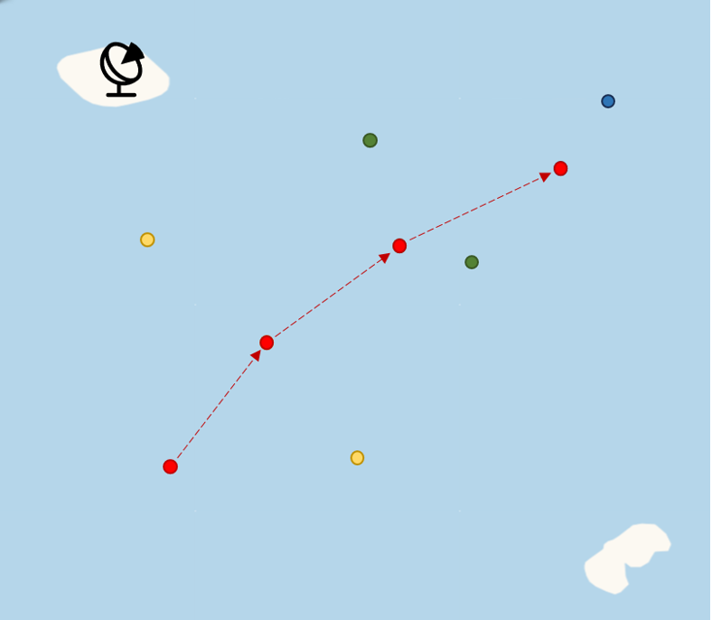
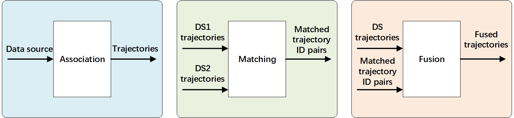

# TrajMaster

## Introduction

This repository implements a trajectory processing system based on multiple data sources, covering single-source trajectory point association, multi-source trajectory matching, and trajectory fusion. The system aims to provide precise and efficient multi-source data processing capabilities for target tracking scenarios.

## Installation

You need to download the project directory. After entering the project directory, you can start using the functionality of the project by invoking the corresponding modules as described in the examples below.

The project requires the following Python libraries: `filterpy`, `geographiclib`, `geopy`, `numpy`, `pandas`, `pyproj`, `scipy`, `tqdm`.

You can install them using `pip` and the provided *requirements.txt* file:

```
pip install -r requirements.txt
```

## Quick Start

```
python main.py
```

## **Code Structure**

The code consists of three main modules, each corresponding to one of the three primary features described below:

- **`association.py`**: This module implements the single-source trajectory point association feature, consolidating raw trajectory points into continuous trajectories based on spatiotemporal association rules.
  
- **`matching.py`**: This module implements a multi-source trajectory matching algorithm, which pairs trajectories generated by two different data sources to identify trajectories belonging to the same target.
  
- **`fusion.py`**: This module fuses trajectories belonging to the same target from different sources, resulting in more complete and accurate trajectories.
  
## Demo

### Input

The `input` directory contains simulated data source samples as examples. These include trajectory point data collected by multiple data sources over a period, where the targets are unknown.

**Data Description**:

- `1.csv`: Trajectory points collected by Data Source 1 during a certain period, containing fields such as `time`, `ds_id`, `lon`, and `lat`.

### Output

The `output` directory contains results after trajectory association and trajectory fusion.

**Examples**:

- `ds1_trajs.csv`: Stores the results of the `association` process for Data Source 1.
- `fused_trajs.csv`: Stores the results of trajectory matching and fusion across multiple data sources.

## Module Descriptions
  
### 1. `association.py` — Single-Source Trajectory Association

**Feature Overview**
The `association` method, a core function of the `Traj_Association` class, associates trajectory points across multiple time steps. It compares trajectory points from the current and previous time steps, identifies points belonging to the same target, and updates target trajectories based on predicted points. The final output is the associated trajectories.

**Dependencies**:

- `Points_Association`: Responsible for specific trajectory point association logic.
- `Traj_Predict`: Implements trajectory prediction based on the Kalman filter algorithm.

**Applicable Scenarios**:

- Suitable for associating target trajectory points in single-source scenarios.

------

### 2. `matching.py` — Multi-Source Trajectory Matching

**Feature Overview**
The `matching.py` module's core function is to match and associate trajectories across multiple data sources. By comparing trajectory data from different sources, this method identifies pairs of trajectories belonging to the same target and generates matching results.

**Applicable Scenarios**:

- Used for matching trajectory data of the same target collected by different data sources in multi-source scenarios.

------

### 3. `fusion.py` — Multi-Source Trajectory Fusion

**Feature Overview**
The `fusion.py` module's core function is to fuse trajectories after cross-source matching, generating unified trajectory files. Using a Kalman filter-based trajectory fusion algorithm, it eliminates noise and errors, resulting in more accurate trajectories.

**Applicable Scenarios**:

- Suitable for fusing trajectories of the same target from multiple data sources to generate more accurate trajectories that closely reflect the true motion of the target.

