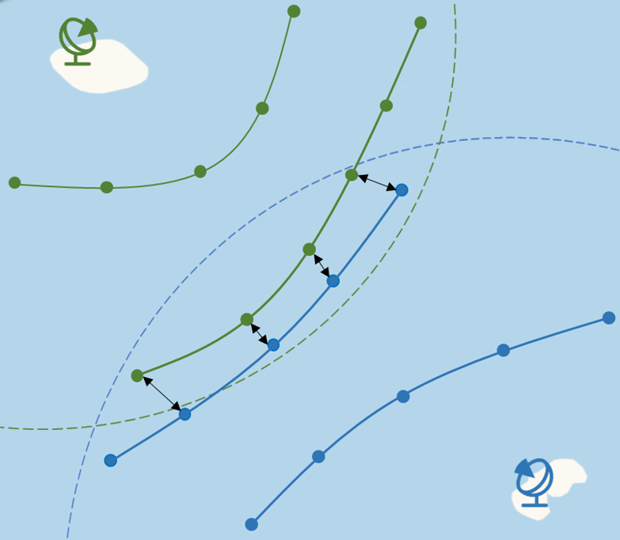

# TrajMaster

## **项目简介**

本仓库实现了一套基于多数据源的轨迹处理系统，涵盖单数据源轨迹点关联、多数据源轨迹匹配和轨迹融合。该系统旨在为目标跟踪场景提供精准、高效的多数据源数据处理能力。

## 安装

您需要下载项目目录。 进入项目目录后，您可以通过调用相应的模块来开始使用项目的功能，如以下示例所述。

该项目需要 python 库：filterpy, geographiclib, geopy, numpy, pandas, pyproj, scipy, tqdm

您可以使用 pip 和提供的 *requirements.txt* 文件安装它们。

```
pip install -r requirements.txt
```

## 快速开始

```
python main.py
```

## 代码组成

该代码由 3个主要模块组成，每个模块对应于下面描述的三个主要功能之一：

- `association.py`：该模块实现单数据源的轨迹点关联功能，将原始轨迹点根据时空关联规则整合为连续的轨迹。

  

- `matching.py`：该模块实现了**多数据源轨迹匹配算法**，用于在两个数据源生成的轨迹集之间进行配对关联，得出不同数据源下属于同一目标的轨迹。

  

- `fusion.py`：将匹配后的属于同一目标的轨迹进行轨迹融合，得到多个数据源下更完整准确的目标轨迹。

  

## Demo
### 输入文件

input目录包含用作示例的仿真数据源数据。包含多个数据源在一段时间内采集的目标未知的轨迹点数据。

数据描述：

`1.csv`:数据源1在一段时间内收集到的未知目标的轨迹点，包含time,ds_id,lon,lat信息.

### 输出文件

output目录包含轨迹关联和轨迹融合后的结果。

例如：

ds1_trajs.csv存放数据源1在association后的结果。

fused_trajs.csv存放多个数据源轨迹匹配融后的结果。

## 详细模块说明
  

1.`association.py`--数据源轨迹关联

**功能简介**

`association` 方法是 `Track_Association` 类的核心功能，负责将目标在多个时间步的轨迹点进行时空关联。它通过比较当前时间步与上一时间步的轨迹点，判断哪些轨迹点属于同一个目标，并根据预测的轨迹点对目标轨迹进行更新。最终，它输出关联后的轨迹。

`association` 方法依赖两个外部模块：

- `Points_Association`：负责轨迹点的具体关联逻辑。
- `Traj_Predict`：基于卡尔曼滤波算法实现轨迹预测。

**模块适用场景**：单数据源下的目标轨迹点关联。

2.`matching.py`--多数据源轨迹匹配

**功能简介**

`matching.py` 模块的核心功能，用于实现跨数据源的轨迹匹配和关联。通过比较不同数据源的轨迹数据，该方法识别属于同一目标的轨迹对，并生成匹配结果。

**模块适用场景**：在多数据源场景下，用于匹配不同数据源采集的同一目标轨迹数据。

3.`fusion.py`--多数据源轨迹融合

**功能简介**

`fusion.py` 模块的核心功能，用于将经过跨数据源匹配的轨迹进行融合，并生成统一的轨迹文件。通过卡尔曼滤波器的轨迹融合算法，消除噪声和误差，生成更精确的目标轨迹。

**模块适用场景**：在多数据源场景下，融合多个数据源中属于同一目标的轨迹，生成更精确、更接近目标真实运动的轨迹。


